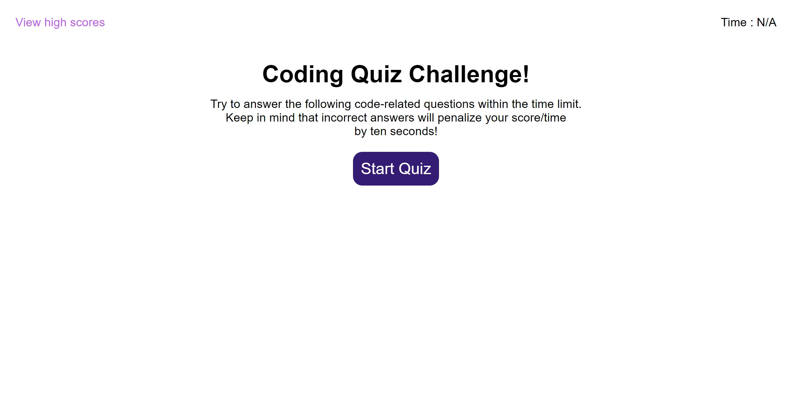

# Code Quiz Challenge

## Contents
This is Adrian Jimenez's Code quiz challenge submission. 

To start this project I took what I knew of the HTML DOM API to start mapping out what I wanted the page to look like. I laid out the initial html, tested styles through trial and error, and then would use javascript to generate the content within separate functions. I added the content of each quiz question into an array of objects, allowing me to create a function responsible for constructing every question onto the page as opposed to having a separate function for every question I wanted. Once I got the questions and logic to a place that was satisfactory, I created functions to save and load high scores from the user into local storage, allowing the high scores to persist past the session. Finally, I tweaked some styles, organized my code and added media queries to make sure the page was responsive.

## Built With
* HTML
* CSS
* JavaScript

## Preview

## Website

## Credits
Made by Adrian Jimenez

## License

MIT License

Copyright ©️ 2022 Adrian Jimenez

Permission is hereby granted, free of charge, to any person obtaining a copy
of this software and associated documentation files (the "Software"), to deal
in the Software without restriction, including without limitation the rights
to use, copy, modify, merge, publish, distribute, sublicense, and/or sell
copies of the Software, and to permit persons to whom the Software is
furnished to do so, subject to the following conditions:

The above copyright notice and this permission notice shall be included in all
copies or substantial portions of the Software.

THE SOFTWARE IS PROVIDED "AS IS", WITHOUT WARRANTY OF ANY KIND, EXPRESS OR
IMPLIED, INCLUDING BUT NOT LIMITED TO THE WARRANTIES OF MERCHANTABILITY,
FITNESS FOR A PARTICULAR PURPOSE AND NONINFRINGEMENT. IN NO EVENT SHALL THE
AUTHORS OR COPYRIGHT HOLDERS BE LIABLE FOR ANY CLAIM, DAMAGES OR OTHER
LIABILITY, WHETHER IN AN ACTION OF CONTRACT, TORT OR OTHERWISE, ARISING FROM,
OUT OF OR IN CONNECTION WITH THE SOFTWARE OR THE USE OR OTHER DEALINGS IN THE
SOFTWARE.
